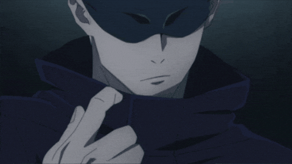
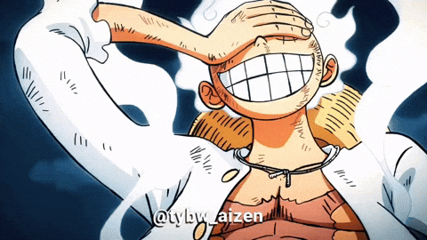

<div align="center">
  


</div>

<p align="center">
  
</p>

<p align="center">
  
</p>

<p align="center">
  
  
  
</p>

---

## 🌾 FOCO ATUAL: Agrinho 2026 — Front-end 🚀

<div align="center">

[](https://www.sistemafaep.org.br/agrinho/)
[](#)

</div>

> 🎯 No momento estou com **foco total** no **Concurso Agrinho 2026**, competindo na modalidade **Front-end / Página da Web**! 🌱💻

<div align="center">

| 📌 Item | 📝 Detalhes |
|:-------:|:-----------|
| 🏆 **Competição** | Agrinho 2026 (Sistema FAEP/SENAR-PR) |
| 💼 **Modalidade** | Front-end / Página da Web |
| 🛠️ **Tecnologias** | `HTML5` `CSS3` `JavaScript` |
| 🎨 **Foco** | Design responsivo + Acessibilidade + Conteúdo educativo |
| 🌱 **Tema** | Conscientização e educação no campo |
| 🚧 **Status** | Em desenvolvimento intenso 🔥 |

</div>

```progress
🌾 Agrinho 2026 — Front-end
```

<div align="center">

 **40% concluído** — Bora pra cima! 💪

### 🎯 Etapas do projeto:
✅ Definir o tema e estrutura  
✅ Esboçar layout (wireframe)  
🔄 Desenvolvendo HTML semântico  
🔄 Estilizando com CSS  
⏳ Adicionar interatividade com JavaScript  
⏳ Testes de responsividade  
⏳ Entrega final 🏆  

</div>

---

## 🎴 Card de Apresentação

<div align="center">

```diff
+ 🌟 Nome: João Gabriel
+ 🎮 Username: JAOG1V1
+ 📍 De onde: Douradina - Paraná, Brasil 🇧🇷
+ 💼 Profissão: Dev em formação 👨‍💻
+ 🎯 Foco atual: Agrinho 2026 — Front-end 🌾
+ 🌱 Aprendendo: HTML, CSS, JavaScript, Java, C++
+ 🏆 Game favorito: Fortnite (caçando Vitória Real!)
+ ⚡ Sonho: Virar dev profissional e criar projetos incríveis
- ☕ Vício confirmado: Energético + madrugadas codando
```

</div>

---

## 🌀 Sobre mim

```javascript
const joaoGabriel = {
  apelido: "JAOG1V1",
  localizacao: "Douradina, PR 🇧🇷",
  status: "Dev em formação 👨‍💻",
  focoAtual: "🌾 Agrinho 2026 — Front-end",
  estudando: ["HTML", "CSS", "JavaScript", "Java", "C++"],
  vibe: "Otaku + Gamer + Codador",
  gameFavorito: "🏆 Fortnite",
  animesFavoritos: [
    "🌀 Jujutsu Kaisen",
    "⚔️ Demon Slayer",
    "🐉 Dragon Ball",
    "🏴‍☠️ One Piece",
    "👊 One Punch Man",
    "📓 Death Note",
    "👻 Dandadan"
  ],
  hobbies: [
    "💻 Codar até de madrugada",
    "🏆 Jogar Fortnite com a galera",
    "🎮 Outros games",
    "📺 Maratonar anime",
    "🎵 Ouvir música",
    "📚 Aprender coisas novas"
  ],
  combustivel: "⚡ Energético",
  filosofia: "Errar é commit, aprender é push 🚀",
  metaDoMomento: "🌾 Mandar bem no Agrinho 2026!"
};
```

---

## 🏆 Sobre o Fortnite

<div align="center">

[](https://www.fortnite.com/)

> 🎯 **Modo favorito:** Battle Royale  
> 🔫 **Arma preferida:** A que aparecer na hora do desespero 😂  
> 🪂 **Local de drop:** Onde dá pra fazer kill rápido  
> 🏗️ **Estilo de jogo:** Builder / No-Build (depende do humor)  
> 🏆 **Maior conquista:** Aquele clutch 1v4 que ninguém acredita  
> 👥 **Como prefiro jogar:** Squad com a galera (mais diversão!)  

</div>

---

## ❤️ Coisas que eu AMO

<div align="center">

| 🎌 Animes | 🎮 Games | 🎵 Música | 🍕 Comidas |
|:---------:|:--------:|:---------:|:----------:|
| Jujutsu Kaisen | **🏆 Fortnite** | Funk | Pizza 🍕 |
| One Piece | Free Fire | Trap | Hambúrguer 🍔 |
| Demon Slayer | Minecraft | Lo-fi (pra codar) | Açaí 🍇 |
| Dragon Ball | GTA | Rock | X-tudo 🥪 |
| Death Note | Roblox | Eletrônica | Sushi 🍣 |

</div>

---

## 😅 Coisas que eu NÃO curto

```yaml
- 🐛 Bugs que aparecem só em produção
- 🌅 Acordar cedo
- 📵 Internet lenta (Fortnite com lag é dor no coração 💔)
- 🥦 Comida saudável demais (sorry)
- 😴 Aula chata
- 🔇 Ficar sem música codando
- 💀 Levar headshot no primeiro pouso do Fortnite
```

---

## ⚔️ Arsenal de Combate (Stack)

<div align="center">

### 💻 Linguagens
[](https://developer.mozilla.org/pt-BR/docs/Web/HTML)
[](https://developer.mozilla.org/pt-BR/docs/Web/CSS)
[](https://developer.mozilla.org/pt-BR/docs/Web/JavaScript)
[](https://www.java.com/)
[](https://isocpp.org/)

### 🛠️ Ferramentas
[](https://git-scm.com/)
[](https://github.com/)
[](https://code.visualstudio.com/)
[](https://www.markdownguide.org/)

### 💻 Sistema & Games
[](https://www.microsoft.com/windows)
[](https://www.epicgames.com/)

</div>

### 📈 Meu nível em cada tech

<div align="center">

| Tecnologia | Nível | Progresso |
|:----------:|:-----:|:---------:|
| 🌐 HTML | Intermediário |  |
| 🎨 CSS | Intermediário |  |
| ⚡ JavaScript | Aprendendo |  |
| ☕ Java | Iniciante |  |
| 🔧 C++ | Iniciante |  |
| 🏆 Fortnite | Pro Player 😎 |  |

</div>

---

## 🏆 Minhas Conquistas

<div align="center">

🎯 **Primeiro site criado do zero** — O Melhor Bolo de Cenoura 🌽  
🎮 **Primeiro joguinho em JS** — RacingGame 🏎️  
🏜️ **Projeto interativo** — Mistérios do Sertão  
🎬 **Catálogo pessoal** — Cinefavoritos  
🐙 **Perfil GitHub estilizado** — Esse aqui que você tá vendo! ✨  
📚 **Aprendendo várias linguagens em paralelo** sem desistir  
💪 **Consistência** — codando todo dia, mesmo cansado  
🌾 **Encarando o Agrinho 2026** — Front-end na veia!  
🏆 **Várias Vitórias Reais no Fortnite** — Builder ou No-Build, tanto faz!  

</div>

---

## 📜 Citação do dia

<div align="center">
  


</div>

---

## 📊 Estatísticas Ninja

<div align="center">
  


<br/>


<br/><br/>


</div>

---

## 🏆 Troféus desbloqueados

<div align="center">
  


</div>

---

## 🐍 Snake comendo meus commits

<div align="center">
  


</div>

---

## 🎮 Projetos em destaque

<div align="center">

| Projeto | Descrição | Tech |
|---------|-----------|------|
| 🌾 **Agrinho 2026** *(em breve)* | Página web pro concurso Agrinho 2026 | `HTML` `CSS` `JS` |
| 🏜️ [**misterios-do-sertao**](https://github.com/JAOG1V1/misterios-do-sertao) | Aventura interativa no sertão brasileiro | `HTML` `CSS` `JS` |
| 🌽 [**Site-O-Melhor-Bolo-de-Cenoura**](https://github.com/JAOG1V1/Site-O-Melhor-Bolo-de-Cenoura) | Meu primeiro site do zero | `HTML` `CSS` |
| 🏎️ [**RacingGame**](https://github.com/JAOG1V1/RacingGame) | Jogo de corrida em JavaScript | `JS` |
| 🎬 [**cinefavoritos**](https://github.com/JAOG1V1/cinefavoritos) | Catálogo dos meus filmes favoritos | `HTML` |

</div>

### 🚀 O que vem por aí?

- 🌾 **Projeto Agrinho 2026** — Foco principal do momento!
- 🌐 **Site pessoal completo** — Falando tudo sobre mim
- 🎮 **Novos joguinhos em JS** — Pra treinar lógica
- 📱 **Projetos responsivos** — Pra rodar em qualquer tela
- 🧠 **Mais estudos em Java e C++** — Indo além do front
- 🏆 **Quem sabe um fan-site do Fortnite?** 👀

---

## 🎯 Metas 2026

<div align="center">

| Meta | Progresso |
|:-----|:---------:|
| 🌾 **Arrasar no Agrinho 2026 (Front-end)** |  |
| 💻 Dominar JavaScript moderno |  |
| 🌐 Lançar meu site pessoal |  |
| 🚀 Criar 5 projetos novos |  |
| ⚛️ Aprender um framework (React?) |  |
| 🌟 Contribuir em projeto open source |  |
| 🏆 Mais Vitórias Reais no Fortnite |  |

</div>

---

## 🌐 Me acha por aí

<div align="center">

[](https://www.instagram.com/joaogabrielsv2010)
[](https://www.tiktok.com/@joaogabrielsv2010)
[](https://x.com/Joaogabrielsv10)
[](mailto:joaogabrielsabedra@gmail.com)
[](https://github.com/JAOG1V1)

</div>

---

## 🎵 Soundtrack do momento

<div align="center">

> 🎧 **Codando ao som de:** Funk, Trap e Lo-fi  
> 🎬 **Maratonando:** Jujutsu Kaisen + Dandadan  
> 🌾 **Codando pra:** Agrinho 2026 — Front-end!  
> 🏆 **Jogando:** Fortnite (caçando Vitória Real com a squad!)  

</div>

---

## 💡 Curiosidades sobre mim

<div align="center">

🌙 Sou mais produtivo de **madrugada**  
☕ Energético é praticamente meu **sangue**  
🌾 Tô focadão no **Agrinho 2026** — front-end na veia!  
🎮 Já tentei criar um joguinho de RPG (deu ruim, mas foi divertido)  
🏆 No **Fortnite**, sou daqueles que cai em local cheio só pra dar emoção 😎  
🪂 Já dropei na **Torre Inclinada** (saudades) tantas vezes que dá pra fazer mapa  
🦊 Acho que seria um **espírito amaldiçoado classe S** se fosse JJK  
🍕 Pizza com borda de catupiry é **lei**  
📺 Já assisti tantos animes que perdi a conta  
💻 Aprendi HTML antes mesmo de saber o que era "tag"  
🔥 Meu sonho é trabalhar com **desenvolvimento de jogos** um dia  

</div>

---

<div align="center">

### 💭 "Stand proud, dev. You're strong." — adaptado de JJK



**⚡ Powered by energético, anime, Fortnite, Agrinho 2026 e madrugadas mal dormidas ⚡**

### ⭐ Curtiu o perfil? Deixa uma estrelinha no repo!


</div>
